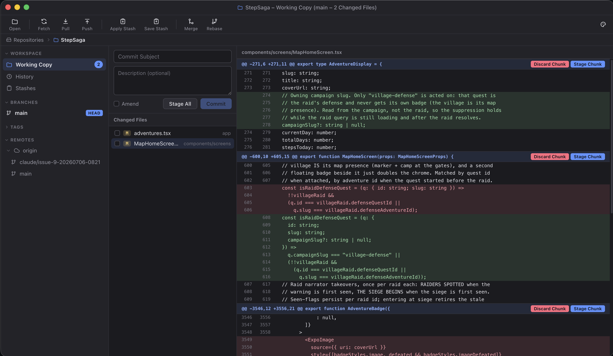
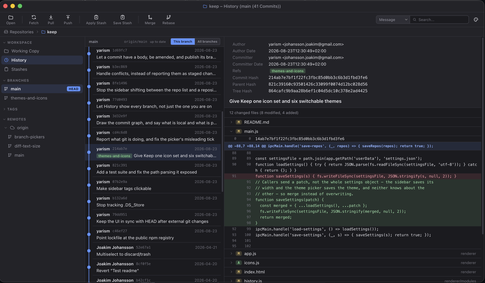

# Keep

A Git GUI client inspired by [Tower](https://www.git-tower.com/), built with Electron.

[](https://github.com/yarism/keep/actions/workflows/build.yml)





## Download

Grab the newest release — these links never go stale, they always resolve to
whatever the latest published release is:

| Platform | |
|---|---|
| [**macOS — Apple Silicon**](https://github.com/yarism/keep/releases/latest/download/Keep-mac-arm64.dmg) | M1 and later |
| [**macOS — Intel**](https://github.com/yarism/keep/releases/latest/download/Keep-mac-x64.dmg) | |
| [**Windows**](https://github.com/yarism/keep/releases/latest/download/Keep-win-x64.exe) | 64-bit installer |

Or browse [all releases](https://github.com/yarism/keep/releases). Nothing is
code-signed yet, so see [Installing Without Terminal](#installing-without-terminal)
for the one extra click each platform asks for.

## Features

- Visual working copy with staged/unstaged changes
- Inline diffs with hunk-level staging and discarding
- Commit history browser with a commit graph, full details and changesets
- Local vs remote at a glance — ahead/behind counts on branches and on the
  Pull and Push buttons, and unpushed commits drawn as hollow nodes
- History scoped to one branch or to every branch at once
- Commit subjects and descriptions, amending, and publishing a new branch
- Conflict handling — merge and rebase state, per-file resolution, abort
- Branch management — create, rename, delete, checkout
- Remote branches visible under each remote
- Stash support — save, apply, drop
- Merge, rebase, and revert operations
- Tag creation
- Multi-repository support
- Detached HEAD state handling
- Context menus throughout (right-click on branches, commits, files)
- Six colour themes, switchable from the toolbar
- Progress and results reported for every toolbar command

## Fetching

Keep fetches in the background every ten minutes, so the ahead/behind counts
mean something without you pressing Fetch first. It never touches the working
copy — only the remote-tracking refs — and it runs non-interactively, so a
repository that would ask for a password is skipped rather than left hanging.
The Fetch button's tooltip says when the last one got through.

To change the interval, or switch it off, set `autoFetchMinutes` in
`settings.json` (`0` disables it). The file lives in Electron's user-data
directory — `~/Library/Application Support/Keep` on macOS.

## Themes

Click the palette button at the right of the toolbar to switch themes. Hovering
a theme previews it live without committing to it — the tick stays on the one
you actually chose — and the preview is undone if you leave the list. The choice
is remembered between launches.

| Theme | |
|---|---|
| **Graphite Light** | the default — neutral greys, blue accent |
| **Graphite Dark** | the same palette after dark |
| **Midnight** | Keep's original purple-tinted dark theme |
| **Nord** | cool blue-greys |
| **Ivory** | warm paper, espresso ink, bronze — the restrained one |
| **Synthwave** | deep indigo with magenta and mint — the loud one |

A theme is just a map of CSS custom properties in `renderer/themes.js` — no
colour is written literally in `styles.css`, so adding one means adding an entry
to that file and nothing else. `test/theme.test.mjs` enforces both halves of
that rule.

## Requirements

- [Node.js](https://nodejs.org/) (v18 or later)
- [Git](https://git-scm.com/) installed and available in your PATH

## Getting Started

### 1. Clone and install

```bash
git clone https://github.com/yarism/keep.git
cd keep
npm install
```

### 2. Run in development mode

```bash
npm start
```

### 3. Build distributables

```bash
# macOS (.dmg)
npm run dist

# Windows (.exe installer)
npm run dist:win

# Linux (.AppImage)
npm run dist:linux

# All platforms
npm run dist:all
```

Output goes to the `dist/` folder.

## Releasing

Cutting a release is one command. Pick the part of the version that moved:

```bash
npm version patch   # 1.0.0 -> 1.0.1  a fix
npm version minor   # 1.0.0 -> 1.1.0  a new feature
npm version major   # 1.0.0 -> 2.0.0  a breaking change
```

Each one runs the test suite first and stops if anything fails, then bumps
`package.json`, commits, tags, and pushes the tag. GitHub Actions picks the tag
up, builds the DMGs and the Windows installer on real macOS and Windows runners,
and publishes the release once both platforms are built, with notes generated
from the commits since the last tag.

There is nothing to approve. The download links at the top of this README point
at the new version the moment the build goes green — usually two or three
minutes after the push.

Every push to `main` builds the same installers too, but leaves them as workflow
artifacts on the [run](https://github.com/yarism/keep/actions) rather than
releasing them — useful for testing a build before you tag it.

## Installing Without Terminal

### macOS

1. Double-click the `.dmg` to mount it
2. Drag **Keep** into your **Applications** folder
3. The first launch is refused: *"Apple could not verify 'Keep' is free of
   malware."* Keep is not signed with an Apple Developer certificate, so there is
   nothing for macOS to check it against. Click **Done** — never **Move to Bin**
   — then open **System Settings → Privacy & Security**, scroll down to
   **Security**, and click **Open Anyway** beside the message about Keep.

   The right-click → **Open** shortcut that used to work was removed in macOS 15.
   From a terminal, this does the same job in one step:

   ```bash
   xattr -dr com.apple.quarantine /Applications/Keep.app
   ```

### Windows

1. Run the `.exe` installer from the `dist/` folder
2. Follow the setup wizard
3. Launch Keep from the Start Menu or Desktop shortcut

### Linux

1. Make the `.AppImage` executable: `chmod +x Keep-*.AppImage`
2. Double-click it or run it from the terminal

## Project Structure

```
keep/
├── main.js              # Electron main process
├── preload.js           # IPC bridge between main and renderer
├── git.js               # All git operations (child_process)
├── renderer/
│   ├── index.html       # App shell
│   ├── app.js           # App initialization and navigation
│   ├── styles.css       # All styles (colours come from themes.js)
│   ├── themes.js        # Colour themes as CSS custom property maps
│   ├── icons.js         # The app's icon set
│   ├── git-output.js    # Turns raw git output into a readable line or two
│   └── modules/
│       ├── state.js         # Shared state and DOM helpers
│       ├── working-copy.js  # Working copy / staging view
│       ├── history.js       # Commit history view
│       ├── sidebar.js       # Sidebar (branches, tags, remotes)
│       ├── context-menu.js  # Right-click context menus
│       ├── diff.js          # Diff rendering
│       ├── modal.js         # Modal dialogs
│       ├── theme.js         # Theme switching and the picker
│       ├── toast.js         # Transient status messages
│       └── repos.js         # Repository list management
├── assets/
│   ├── icon.icns        # macOS app icon
│   ├── icon.png         # App icon (1024x1024)
│   └── icon.svg         # Icon source
└── package.json
```

## License

ISC
